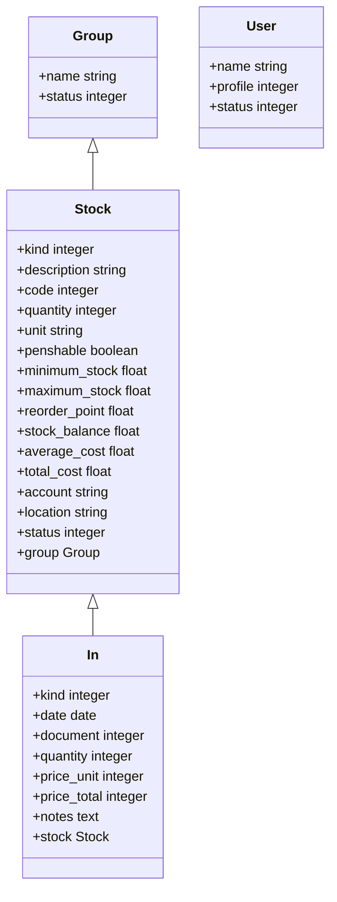

# Warehouse Management System
1. Class Diagram

```mermaid
 classDiagram
  class Group{
      +name string
      +status integer
  }
  class Stock{
    +kind integer
    +description string
    +code integer
    +quantity integer
    +unit string
    +penshable boolean
    +minimum_stock float
    +maximum_stock float
    +reorder_point float
    +stock_balance float
    +average_cost float
    +total_cost float
    +account string
    +location string
    +status integer
    +group Group 
  }

  class In{
    +kind integer
    +date date
    +document integer
    +quantity integer
    +price_unit integer
    +price_total integer
    +notes text
    +stock Stock
  }

  class User {
    +name string
    +profile integer
    +status integer
  }

  Group <|-- Stock
  Stock <|-- In
   
```
